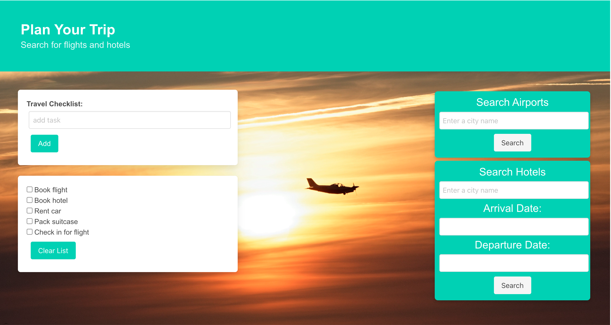

# Trip Planner 

Plan for a trip by creating a travel checklist. Search for airports and hotels near your destination. 

[Trip Planner Website](https://roopathimmanacherla.github.io/trip-planner/)

## Description

Our motivation for this project was to create a travel planning application where users can prepare for a trip in one convenient location. 

This website will help travelers keep track of all the important tasks they must complete before their trip. They will be able to find airports and hotels without visiting separate pages. 

The ultimate goal of this website would be to fill the role of a travel agent. The project could be expanded to include rental cars, reservations for restaurants and activites, and automatically add those items to the checklist to create a detailed itinerary. 

## Usage

Users who visit the Trip Planner website will find an interactive checklist, an airport search feature, and a hotel search feature. 

The user can add tasks to the checklist and check them off as they are completed. This data will be saved in local storage, so that the user can keep track of all of the steps that have been completed for their trip. 

The user can search for airports by entering the name of a city into the search bar. The results will display in a box beneath the search bar. 

The user can search for a hotel by entering the name of a city and the dates they would like to stay. The top 5 results will display in a box beneath the search bar.

Display results for Airrports:

Display message if no airports in the city:

Display results for Hotels:

Display message if no departure date:

Display message if the entered city to search hotels is incorrect:

## Credits

**Collaborators:**
- [Roopa Thimmanacherla](https://github.com/RoopaThimmanacherla)
- [Brandon G.](https://github.com/g00s3mag1k)
- [Alyssa Pupping](https://github.com/ajpupping)

**APIs:**
- [Airport Finder](https://api-ninjas.com/api/airports)
- [Hotel Finder](https://rapidapi.com/tipsters/api/booking-com)

**CSS Framework:**
- [Bulma](https://bulma.io/)

**Background Image:** 
- [Source](https://www.pexels.com/photo/silhouette-of-an-airplane-flying-during-sunset-6629764/)

## License

This web application was created for educational purposes and does not have a license. 
